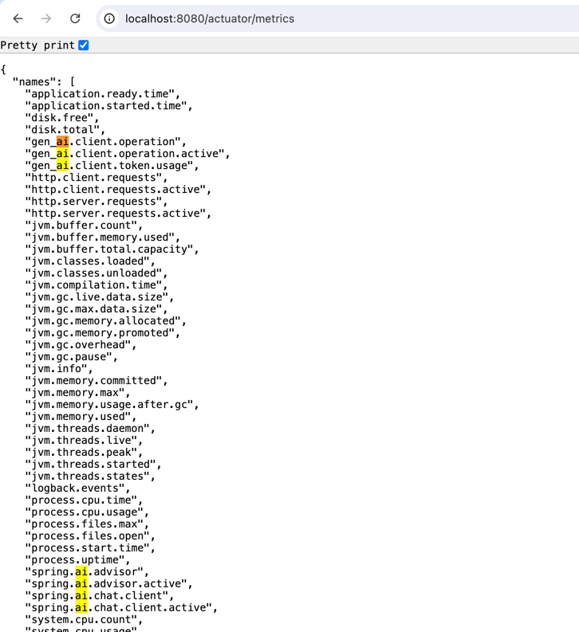
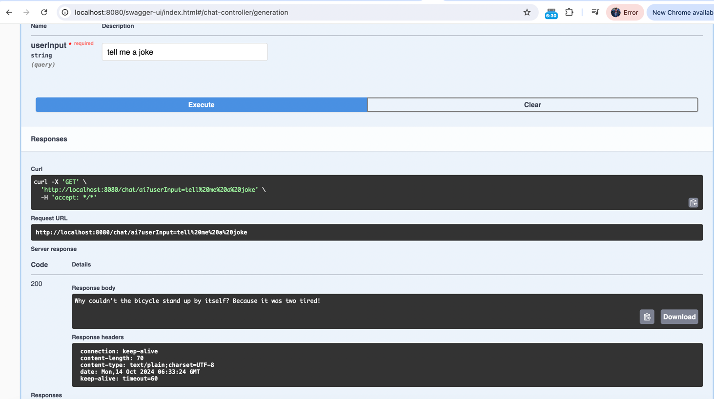

# Leveraging Spring AI for RAG Systems: A Deep Dive into Configuration and Observability

In the ever-evolving landscape of AI-powered applications, Retrieval-Augmented Generation (RAG) systems have emerged as a powerful paradigm. These systems combine the strengths of large language models with the ability to retrieve and incorporate external knowledge. Today, we'll explore how to harness the power of Spring AI to build robust RAG systems, with a focus on configuration and observability.

## Setting Up Spring AI for RAG

Spring AI provides a seamless way to integrate AI capabilities into your Spring applications. Let's start by looking at a basic controller setup for a chat endpoint:

```java
@RestController
@RequestMapping("/chat")
public class ChatController {

    private final ChatClient chatClient;

    public ChatController(ChatClient.Builder chatClientBuilder) {
        this.chatClient = chatClientBuilder.build();
    }

    @GetMapping("/ai")
    String generation(String userInput) {
        return this.chatClient.prompt()
                .user(userInput)
                .call()
                .content();
    }
}
```

This simple controller sets up a `/chat/ai` endpoint that takes user input and returns a response from the AI model. The `ChatClient` is automatically configured based on the application properties.

## Configuring Spring AI

The heart of our RAG system's configuration lies in the `application.properties` file. Let's break down some key configurations:

```properties
spring.ai.openai.api-key=<API_KEY>
spring.ai.openai.chat.options.model=gpt-3.5-turbo
```

These lines set up the OpenAI integration, specifying the API key and the model to use (in this case, GPT-3.5 Turbo).

```properties
spring.ai.chat.client.observations.include-input=true
spring.ai.vectorstore.observations.include-query-response=true
spring.ai.chat.observations.include-prompt=true
spring.ai.chat.observations.include-completion=true
spring.ai.chat.observations.include-error-logging=true
```

These configurations enable comprehensive logging and observability for our RAG system. They ensure that inputs, prompts, completions, and errors are all logged, providing valuable insights into the system's operation.

## Enhancing Observability with Actuator and Jaeger

Spring Boot Actuator is a powerful tool for monitoring and managing your application. The following configuration enables all Actuator endpoints and provides detailed health information:

```properties
management.endpoints.web.exposure.include=*
management.endpoints.health.show-details=always
```

To add distributed tracing to our RAG system, we're now using OpenTelemetry with Jaeger as the tracing backend. First, add the following dependencies to your pom.xml:

```
<dependency>
  <groupId>io.micrometer</groupId>
  <artifactId>micrometer-tracing-bridge-otel</artifactId>
</dependency>
<dependency>
  <groupId>io.opentelemetry</groupId>
  <artifactId>opentelemetry-exporter-otlp</artifactId>
</dependency>
```



```properties
management.tracing.sampling.probability=1
management.opentelemetry.resource-attributes.service.name=spring-ai-nfr-impl
management.otlp.tracing.endpoint=http://localhost:4318/v1/traces
```

This configuration sets up 100% sampling for tracing, names our service "spring-ai-nfr-impl", and specifies the endpoint for the OpenTelemetry collector (in this case, we're assuming Jaeger is running locally on the default port).


## Jaeger vs Zipkin: Why Jaeger is the Better Choice

While both Jaeger and Zipkin are popular distributed tracing systems, Jaeger offers several advantages that make it a superior choice for modern, cloud-native applications like our RAG system:

1. **Better Performance**: Jaeger is designed with performance in mind. It can handle higher throughput and scale more effectively than Zipkin, making it a better fit for large-scale, high-traffic applications.

2. **Native Kubernetes Support**: Jaeger provides out-of-the-box support for Kubernetes, including automatic discovery of agents and collectors. This makes it easier to deploy and manage in containerized environments.

3. **Advanced Querying Capabilities**: Jaeger's query language is more powerful and flexible than Zipkin's, allowing for more complex and insightful analyses of your tracing data.

4. **OpenTracing Compatibility**: While we're using OpenTelemetry in this example, it's worth noting that Jaeger was built with OpenTracing in mind from the start. This heritage ensures excellent compatibility with OpenTelemetry, which has superseded OpenTracing.

5. **Rich UI Features**: Jaeger's user interface is more feature-rich and intuitive than Zipkin's. It provides better visualization of trace data, making it easier to understand the flow of requests and identify performance bottlenecks.

6. **Adaptive Sampling**: Jaeger offers more advanced sampling techniques, including adaptive sampling, which can automatically adjust sampling rates based on the volume of traffic. This helps maintain a balance between data collection and system performance.

7. **Multi-Tenancy Support**: Jaeger has built-in support for multi-tenancy, which is crucial for larger organizations or applications that need to separate trace data for different teams or services.

8. **Active Development**: Jaeger is actively developed and maintained by Uber, with a large and active community. This ensures regular updates, bug fixes, and new features.

By choosing Jaeger for our RAG system's observability stack, we're setting ourselves up for better scalability, more insightful tracing data, and an overall more robust observability solution.

## The Power of Virtual Threads

Spring 6 introduced support for virtual threads, which can significantly improve the performance of I/O-bound applications like our RAG system. Enable them with:

```properties
spring.threads.virtual.enabled=true
```

## API Documentation with SpringDoc

To make our RAG system more developer-friendly, we can add API documentation using SpringDoc:

```properties
springdoc.swagger-ui.path=/swagger-ui.html
```

This configures the Swagger UI path, allowing easy exploration and testing of our API.



## Conclusion

Building a RAG system with Spring AI offers a powerful combination of ease of use and flexibility. By leveraging Spring Boot's robust configuration options and observability tools like Actuator and OpenTelemetry with Jaeger, we can create AI-powered applications that are not only powerful but also maintainable and observable.

The switch to OpenTelemetry provides us with a vendor-agnostic approach to observability, allowing for greater flexibility in choosing and switching between different backends. Jaeger, as our chosen tracing backend, offers powerful distributed tracing capabilities that can help us understand the flow of requests through our system, identify bottlenecks, and troubleshoot issues in our RAG application.

Remember, when working with AI models, especially in production environments, it's crucial to monitor performance, handle errors gracefully, and continuously refine your prompts and retrieval mechanisms. The observability features we've discussed today will be invaluable in this ongoing process of improvement.

As you embark on your journey with Spring AI and RAG systems, keep experimenting, monitoring, and iterating. The field of AI is rapidly evolving, and staying adaptable is key to building successful AI-powered applications. With the power of Spring AI and the observability provided by OpenTelemetry and Jaeger, you're well-equipped to build and maintain sophisticated RAG systems that can adapt to changing requirements and scale with your needs.
