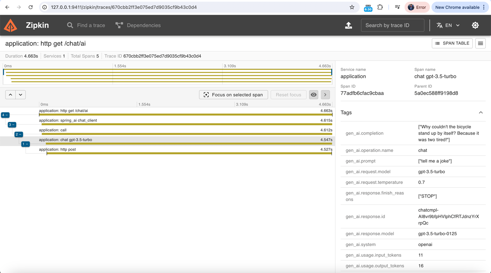

# Leveraging Spring AI for RAG Systems: A Deep Dive into Configuration and Observability

In the ever-evolving landscape of AI-powered applications, Retrieval-Augmented Generation (RAG) systems have emerged as a powerful paradigm. These systems combine the strengths of large language models with the ability to retrieve and incorporate external knowledge. Today, we'll explore how to harness the power of Spring AI to build robust RAG systems, with a focus on configuration and observability.

## Setting Up Spring AI for RAG

Spring AI provides a seamless way to integrate AI capabilities into your Spring applications. Let's start by looking at a basic controller setup for a chat endpoint:

```java
@RestController
@RequestMapping("/chat")
public class ChatController {

    private final ChatClient chatClient;

    public ChatController(ChatClient.Builder chatClientBuilder) {
        this.chatClient = chatClientBuilder.build();
    }

    @GetMapping("/ai")
    String generation(String userInput) {
        return this.chatClient.prompt()
                .user(userInput)
                .call()
                .content();
    }
}
```

This simple controller sets up a `/chat/ai` endpoint that takes user input and returns a response from the AI model. The `ChatClient` is automatically configured based on the application properties.

## Configuring Spring AI

The heart of our RAG system's configuration lies in the `application.properties` file. Let's break down some key configurations:

```properties
spring.ai.openai.api-key=<API_KEY>
spring.ai.openai.chat.options.model=gpt-3.5-turbo
```

These lines set up the OpenAI integration, specifying the API key and the model to use (in this case, GPT-3.5 Turbo).

```properties
spring.ai.chat.client.observations.include-input=true
spring.ai.vectorstore.observations.include-query-response=true
spring.ai.chat.observations.include-prompt=true
spring.ai.chat.observations.include-completion=true
spring.ai.chat.observations.include-error-logging=true
```

These configurations enable comprehensive logging and observability for our RAG system. They ensure that inputs, prompts, completions, and errors are all logged, providing valuable insights into the system's operation.

## Enhancing Observability with Actuator and Zipkin

Spring Boot Actuator is a powerful tool for monitoring and managing your application. The following configuration enables all Actuator endpoints and provides detailed health information:

```properties
management.endpoints.web.exposure.include=*
management.endpoints.health.show-details=always
```

To add distributed tracing to our RAG system, we can integrate Zipkin. The following configuration enables tracing:


```properties
management.tracing.sampling.probability=1
```

This sets the sampling probability to 100%, meaning all requests will be traced. In a production environment, you might want to lower this value to reduce overhead.



## The Power of Virtual Threads

Spring 6 introduced support for virtual threads, which can significantly improve the performance of I/O-bound applications like our RAG system. Enable them with:

```properties
spring.threads.virtual.enabled=true
```

## API Documentation with SpringDoc

To make our RAG system more developer-friendly, we can add API documentation using SpringDoc:

```properties
springdoc.swagger-ui.path=/swagger-ui.html
```

This configures the Swagger UI path, allowing easy exploration and testing of our API.


## Conclusion

Building a RAG system with Spring AI offers a powerful combination of ease of use and flexibility. By leveraging Spring Boot's robust configuration options and observability tools like Actuator and Zipkin, we can create AI-powered applications that are not only powerful but also maintainable and observable.

Remember, when working with AI models, especially in production environments, it's crucial to monitor performance, handle errors gracefully, and continuously refine your prompts and retrieval mechanisms. The observability features we've discussed today will be invaluable in this ongoing process of improvement.

As you embark on your journey with Spring AI and RAG systems, keep experimenting, monitoring, and iterating. The field of AI is rapidly evolving, and staying adaptable is key to building successful AI-powered applications.
